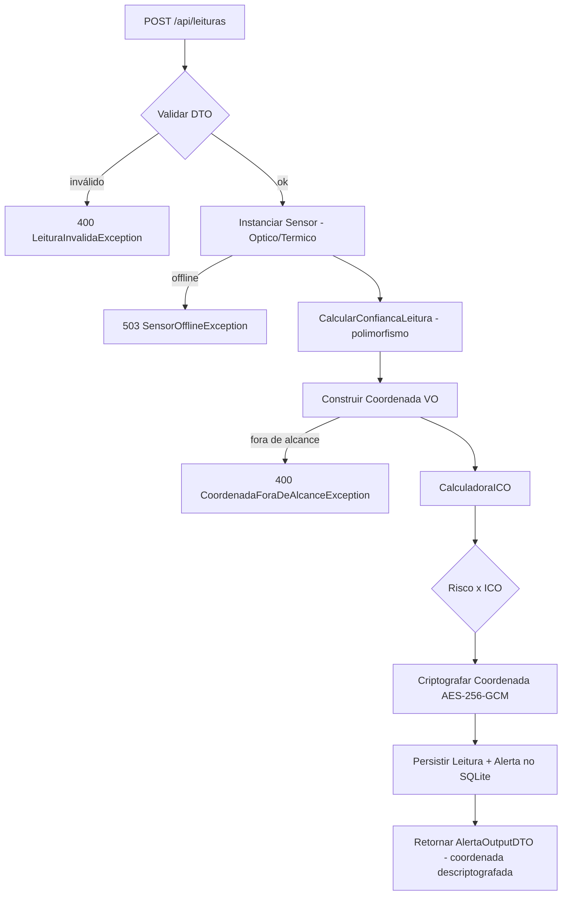

# Diagrama de fluxo — `POST /api/leituras`

O diagrama abaixo mostra o pipeline central do Orbital Trust: da chegada da leitura
até a persistência e a resposta com a coordenada descriptografada.

## A "regra de ouro" (nó `Risco x ICO`)

| Risco estimado (ML) | ICO        | Nível resultante                          |
|---------------------|------------|-------------------------------------------|
| `>= 0.9`            | `>= 75`    | **Crítico**                               |
| `>= 0.7`            | `>= 50`    | **Alto**                                  |
| `>= 0.7`            | `< 50`     | **Moderado** (dado de baixa confiabilidade) |
| `< 0.7`             | qualquer   | **Baixo**                                 |

Alerta só é persistido quando o nível é **Moderado ou maior** — o sistema não grita
alarme forte em cima de dado não-confiável.
